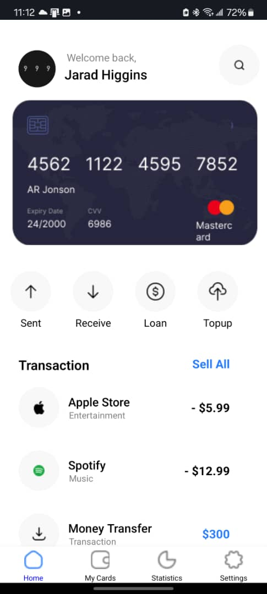
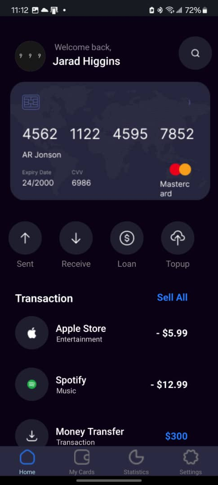
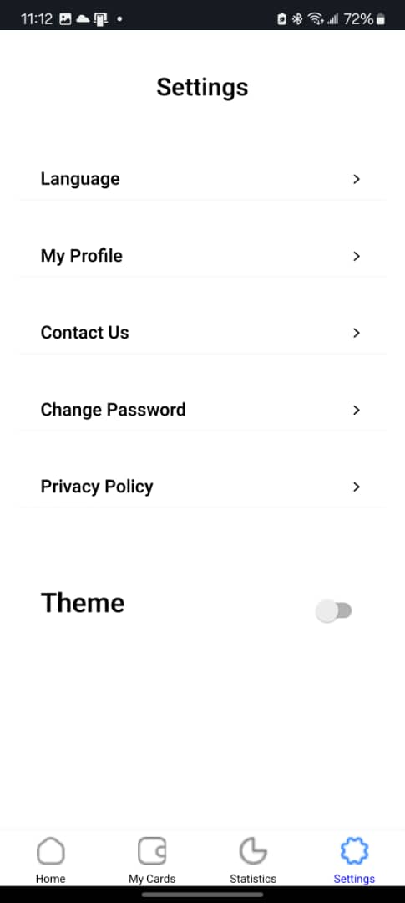
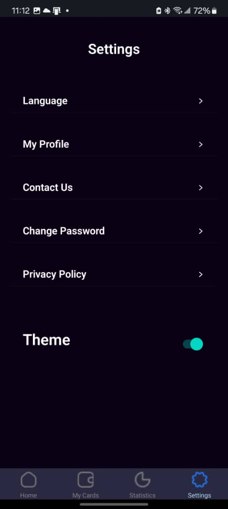

# My Finance App

## Overview

My Finance App is a mobile application designed to help users manage their finances more effectively. Built using React Native, this app offers a user-friendly interface for tracking transactions, managing cards, and analyzing spending patterns. The application supports a dark and light theme, enhancing the user experience according to the user's preference.

### How I Built the Application

1. **Setting Up the Environment**: I started by setting up the React Native environment using the React Native CLI and Expo.

2. **Creating the App Structure**: I structured the app into several key components, including `HomeScreen`, `MyCardsScreen`, `StatisticsScreen`, and `SettingsScreen`. Each screen is designed to handle a specific aspect of the finance management process.

3. **Navigation**: For navigation between the different screens, I used `react-navigation-navigation` and created a bottom tab navigator. This allows users to easily switch between the Home, My Cards, Statistics, and Settings screens.

4. **Theme Management**: To support both dark and light themes, I created a `ThemeContext` using React's Context API. This context allows any component in the app to access and modify the theme settings.

5. **Styling**: I used React Native's `StyleSheet` to create responsive and adaptive styles for each component. The styles change dynamically based on the current theme (dark or light).

6. **Testing**: Throughout the development process, I tested the app on Android using Expo Go to ensure compatibility and responsiveness.

### Screenshots

- Home Screen (Light Theme): 
- Home Screen (Dark Theme): 
- Settings Screen (Light Theme): 
- Settings Screen (Dark Theme): 

### Conclusion

Building My Finance App was a rewarding experience that allowed me to explore various aspects of mobile app development with React Native. From implementing theme switching to navigating between different screens, each step provided valuable learning opportunities. I look forward to enhancing this app further by integrating real data and adding more features.